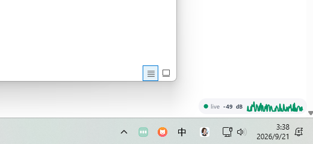
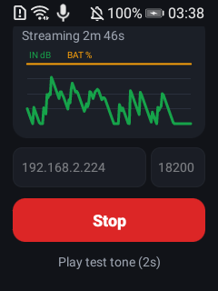

# VMic —— 把 Android 手机变成 Windows 的麦克风

English | **[简体中文](README.zh-CN.md)**

<p>

&nbsp;

</p>

手机采集麦克风音频，通过 WiFi/USB 实时推流到 Windows，经 VB-CABLE 虚拟声卡变成系统级麦克风设备——Zoom、腾讯会议、Discord、OBS、微信里都能直接选用。零成本把闲置手机变成高质量无线麦克风。

- **全链路延迟**：USB 约 40–80ms，WiFi 约 100–200ms
- **Android 端**：前台服务 + 常驻通知，切后台/息屏持续采集，断线自动重连
- **Windows 端**：抗锯齿半透明悬浮胶囊（状态/电平/60s 曲线）+ 任务栏动效托盘图标（均衡柱随声音跳动）
- **协议**：11 字节头的极简 TCP PCM 流，[规范见此](docs/PROTOCOL.md)，任何语言可轻松实现收发端

---

## 工作原理

```
┌──────────────┐   TCP PCM 48k/16bit/mono   ┌──────────────────┐   WASAPI  ┌────────────┐
│  Android App │ ─────────────────────────▶ │ vmic_panel.py    │ ───────▶ │ CABLE Input│
│  Foreground  │      (WiFi / USB adb)      │ 接收 + Jitter    │          │ (VB-CABLE) │
│  Service     │                            │ Buffer + 电平统计 │          └─────┬──────┘
└──────────────┘                            │ + 悬浮窗 + 托盘  │                 │ 驱动桥接
                                            └──────────────────┘                 ▼
                                                            Zoom/会议/OBS ◀── CABLE Output（虚拟麦克风）
```

> VB-CABLE 是 [VB-Audio Software](https://vb-audio.com/Cable/) 出品的免费虚拟声卡（donationware）。
> 它成对提供"播放设备 CABLE Input（写入端）"和"录制设备 CABLE Output（虚拟麦克风）"——
> 这是 Windows 音频架构下暴露虚拟麦克风的通用做法，任何同类方案（VoiceMeeter/付费 VAC）均如此。

## 快速开始

### Windows 端（一次性）

1. **安装 VB-CABLE**：[官网下载](https://vb-audio.com/Cable/) `VBCABLE_Driver_Pack45.zip`，解压后管理员运行 Setup，**重启**。
2. **统一采样率**：声音设置 → 播放设备 `CABLE Input` → 属性 → 高级 → **48000 Hz**；录制设备 `CABLE Output` 同样设为 48000 Hz（避免 Windows 重采样杂音）。
3. **安装依赖并启动**：
   ```powershell
   cd windows\vmic_rx
   python -m pip install -r requirements.txt
   start_panel.cmd        # 无终端启动：悬浮胶囊 + 托盘图标
   # 或 python vmic_rx.py # 传统控制台模式
   ```

> 想开机自启：`Win+R` → `shell:startup` → 把 `start_panel.cmd` 的快捷方式放进去。

### Android 端

1. 用 Android Studio 打开 `android/` 构建安装（minSdk 24），或直接下载 Release APK。
2. App 填入电脑局域网 IP（与手机同一 WiFi），之后自动连接并记忆。
3. 首次启动会依次申请：麦克风、通知权限、电池优化白名单（保活）。
4. 在会议软件里把麦克风选为 **`CABLE Output (VB-Audio Virtual Cable)`**，完成。

**连接方式**：
- **WiFi 直连（默认）**：手机填电脑 IP，需同一局域网；若防火墙拦截（Public 网络常见），管理员执行
  `netsh advfirewall firewall add rule name="vmic-rx" dir=in action=allow protocol=TCP localport=18200`
- **USB / 无线 adb**（最稳、免防火墙）：电脑执行 `adb forward tcp:18200 tcp:18200`（USB）或
  `adb connect <手机IP>:5555 && adb reverse tcp:18200 tcp:18200`，App 里 Host 填 `127.0.0.1`

## 使用说明

### Android App

| 元素 | 说明 |
|---|---|
| 主按钮（单键三态） | `Start`（未运行）→ `Auto …`（连接/重试中，每 3s）→ `Stop`（推流中） |
| IN dB 曲线 | 输入电平，dB 对数刻度（-60..0），EMA 平滑，60 秒滚动 |
| BAT % 曲线 | 电池电量，可观察推流期间耗电 |
| Test tone | 手机播 2 秒 880Hz 测试音，自检 喇叭→麦→网络→虚拟麦克风 全链路 |
| IP/端口 | SharedPreferences 记忆上次配置 |

**后台保活栈**：前台服务+常驻通知（通知栏可直接 Stop）→ PARTIAL_WAKE_LOCK → **WifiLock 低延迟模式** → 电池优化白名单。已实测 Android 10 小屏设备息屏 90s+ 后进程/服务/推流全部存活。部分国产 ROM 还需手动：设置 → 应用启动管理 → 改"手动管理"允许后台活动。

### Windows 桌面伴侣（vmic_panel.py）

| 元素 | 说明 |
|---|---|
| 悬浮胶囊 | 逐像素 Alpha 分层窗口（`UpdateLayeredWindow`）+ Pillow 4x 超采样渲染：抗锯齿圆角、半透明玻璃质感、hover 提亮；可拖拽，右键 Exit |
| 内容 | 状态点（绿/灰/琥珀）+ 实时 dB + 60s 电平曲线 |
| 托盘图标 | 状态色玻璃徽章 + 三根白色均衡柱 **随真实声音跳动**（VU 快攻慢放包络）；等待时灰柱呼吸；悬停显示 `live · -18 dB` |
| 托盘菜单 | Show / hide panel、Exit |
| 诊断日志 | `%TEMP%\vmic_panel.log`（渲染管线排障用） |

### 全链路自测（无手机）

```powershell
start python vmic_rx.py                                     # 控制台接收端
python mock_sender.py 127.0.0.1 18200 --seconds 5           # 5 秒 440Hz 正弦
```

## VMIC 协议 v1

11 字节小端头（`"VMIC"` + version + sample_rate + channels + bits）后接无帧 PCM 字节流，默认 48kHz/mono/16bit（≈94KB/s）。完整规范：[docs/PROTOCOL.md](docs/PROTOCOL.md)。

## 从源码构建

### Android

```bash
cd android
gradle assembleDebug    # 零第三方依赖，AGP 8.9 + Kotlin 1.9，compileSdk 35
adb install -r app/build/outputs/apk/debug/app-debug.apk
```

### Windows

仅需 Python 3.10+ 与 `requirements.txt`（sounddevice / numpy / Pillow / pystray），无编译。

## 排障 FAQ

| 现象 | 处理 |
|---|---|
| 系统里有 CABLE Input / CABLE In 16ch / CABLE Output 三个设备 | 正常：前两个是虚拟线的播放（进线）端，16ch 是多声道变体（可禁用），应用里选的麦克风是录制端 `CABLE Output` |
| 不想看到 CABLE 的"播放设备" | `CABLE Input` 无实体扬声器、不出声、不抢默认输出；禁用它会断掉桥接导致虚拟麦克风静音，必须保持启用 |
| 声音周期性破裂 | WiFi 抖动：接收端加 `--prebuffer 200`（ms）；或改用 USB |
| 有电流声/变调 | 两端采样率不一致，检查 CABLE Input/Output 高级属性是否 48000 Hz |
| 手机息屏后被杀 | 检查电池优化白名单已允许；国产 ROM 加"启动管理"手动允许后台；root 设备可 `adb shell dumpsys deviceidle whitelist +com.vmic.app`（重启失效）|
| WiFi 连不上 | 防火墙放行 18200 入站；或走 adb 方式绕过 |
| 悬浮窗异常 | 查看 `%TEMP%\vmic_panel.log`；`--null` 模式可隔离音频问题 |

## 已知限制与路线图

- [x] 断线自动重连（两端）
- [x] 后台/息屏保活
- [ ] Opus 编码（v2 协议，面向公网低带宽场景）
- [ ] 接收端多客户端
- [ ] 发布预编译 Release APK
- 接收端为单客户端设计；App 重装会清除 adb reverse 需重做

## 实测环境

- Windows 11（Python 3.14 + VB-CABLE Pack45），ZTE EC520S（Android 10，240×320 小屏，WiFi 直连）全链路验证：息屏后台持续采集、断线自动恢复、Test tone 电平 ~55%
- 开发环境为 WSL2（mirrored 网络）：接收端经 Windows 侧 Python 运行，`cmd.exe /c start "" /min D:\wsp\vmic\serve.cmd` 等互操作命令可从 WSL 直接发起

## 许可证

[MIT](LICENSE)。VB-CABLE 为 VB-Audio Software 的独立产品（免费授权用于个人），使用前请遵守其条款。
